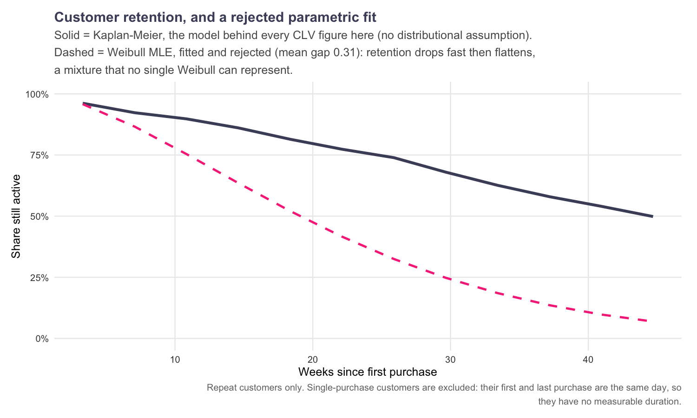
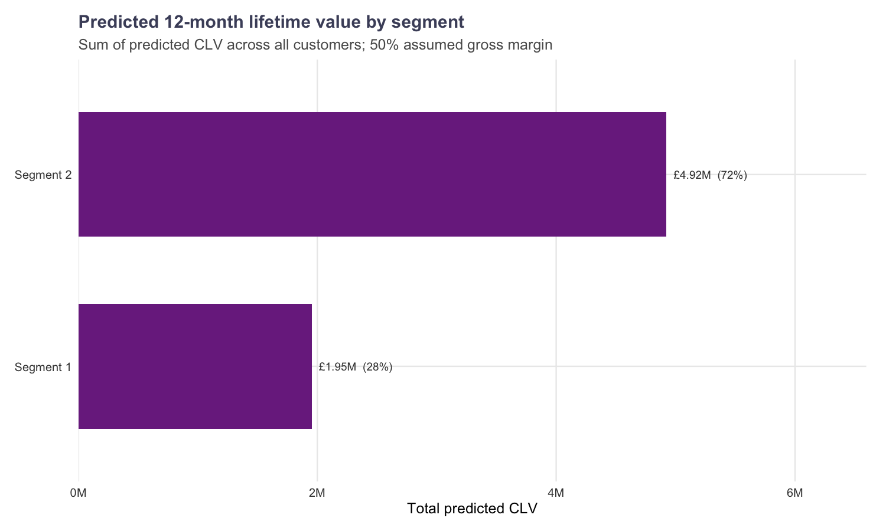
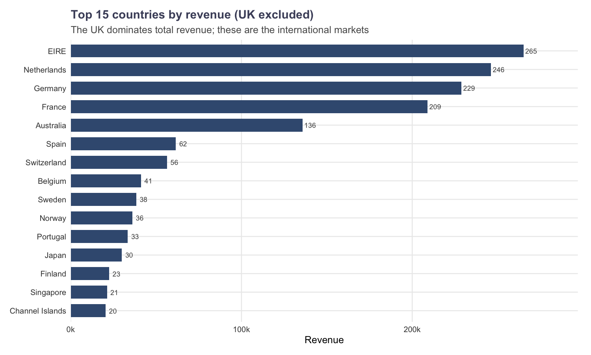
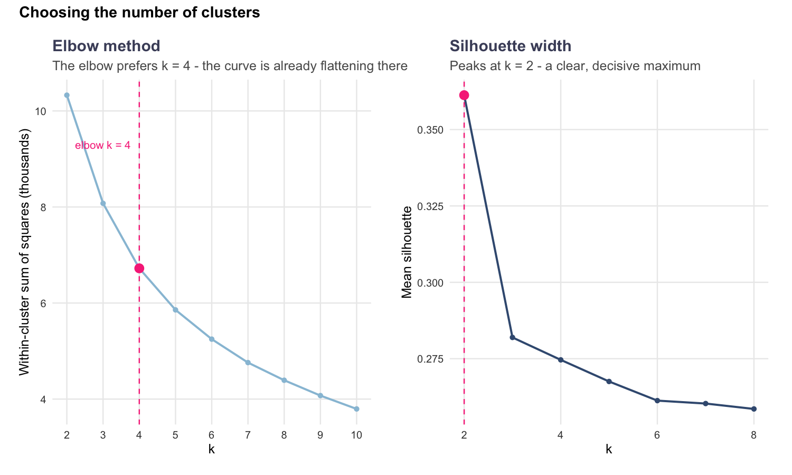
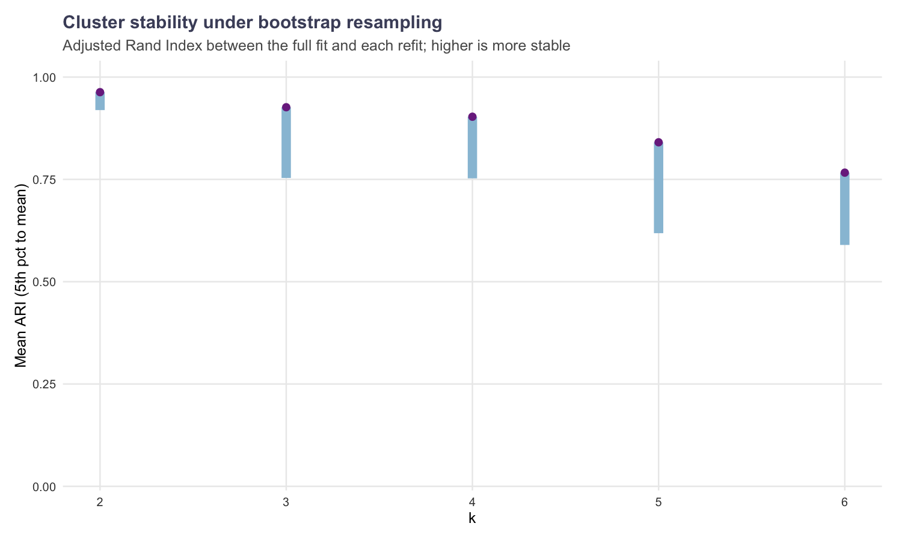

# Retail Customer Lifetime Value & Segmentation

Predicting 12-month customer lifetime value from transaction logs, and turning
that value into segments you can act on.

Built on the [UCI Online Retail II](https://archive.ics.uci.edu/dataset/502/online+retail+ii)
dataset: 541,910 transactions, 37 countries, 12 months of a UK gift-ware
retailer.



---

## The short version

| | |
|---|---|
| **Customers analysed** | 4,331 |
| **Revenue in window** | £8.39M across 18,455 invoices |
| **Segments** | 2 (k chosen by silhouette, stability-verified) |
| **Lifetime model** | Kaplan-Meier (non-parametric) |
| **Chosen k** | 2 — mean silhouette 0.361, bootstrap stability ARI 0.963 |
| **Predicted portfolio CLV** | £6.9M over 52 weeks at an assumed 50% margin |

Two caveats stated up front, because they matter more than the headline number:

1. **The 50% gross margin is an assumption, not a measurement.** The dataset
   contains revenue only — no cost data. Every CLV figure scales linearly with
   margin. Change `CFG$gross_margin` and everything scales.
2. **A Weibull lifetime model was fitted, tested, and rejected.** It disagrees
   with the non-parametric estimate by a mean absolute 0.31 in survival
   probability. The retention curve is a *mixture* — a large population that
   churns almost immediately plus a long-lived tail — which no single Weibull
   can represent. The CLV therefore uses Kaplan-Meier, which assumes nothing
   about the shape of the lifetime distribution. See
   [Why the Weibull is rejected](#why-the-weibull-is-rejected).

---

## Results

### Segments

Segment 1 is the lowest-value group by construction (labels are remapped by
ascending median spend, so "Segment 1" always means the same thing).

| Segment | Customers | Share | Median recency | Median orders | Median spend | Revenue share | CLV share |
|---|---|---|---|---|---|---|---|
| **1** | 2,620 | 60.5% | 95 days | 1 | £354 | 13.6% | 28.4% |
| **2** | 1,711 | 39.5% | 17 days | 5 | £2,062 | 86.4% | 71.6% |

The split is severe and asymmetric. **Segment 2 is 39.5% of customers but 86%
of revenue.** Segment 1 bought once, long ago, and will not buy again — their
predicted CLV is £0, and 28% of the modelled portfolio value comes from the
handful of survivors still inside the activity window.



### What the customer base actually looks like

Revenue is overwhelmingly seasonal and domestic, with a November–December
gift peak. Excluding the UK, the Netherlands, Germany, Ireland, France and
Australia carry the international business.



---

## How it works

```
R/01_data.R        load, clean, audit every row removed
R/02_features.R    line-level and customer-level features
R/03_rfm.R         RFM table + log-space clustering features
R/04_cluster.R     k selection, held-out evaluation, stability
R/05_clv.R         Kaplan-Meier lifetimes -> expected CLV
R/06_report.R      figures and tables (all numbers computed, never transcribed)
_targets.R         the pipeline DAG
```

### 1. Cleaning is a set of rules, and every removal is audited

| Stage | Rows |
|---|---|
| Raw | 541,910 |
| Missing CustomerID (dropped) | −135,080 |
| Missing Description (dropped) | −1,454 |
| Cancellations (dropped) | −8,905 |
| Non-positive UnitPrice (dropped) | −40 |
| Quantity outliers — *whole invoice* dropped | −779 |
| **Final** | **397,106** |

Each rule is a rule, not a hand-picked list of rows. The last rule is the one
worth explaining: a line-item quantity above a Tukey outer fence (3×IQR in log
space) is treated as a data-entry error, and **the entire invoice is dropped** —
both legs of a matched cancellation. Dropping only the negative leg leaves the
original order in place.

### 2. Frequency counts invoices, not timestamps

RFM frequency is `n_distinct(InvoiceNo)`. This matters: `InvoiceDate` is a full
timestamp, so grouping on it counts two orders on the same afternoon as two
separate purchases. There's a regression test for exactly this.

### 3. k is chosen by a stated policy, then stress-tested

The three standard criteria **disagree** on this data:

| Criterion | Prefers |
|---|---|
| Elbow (maximum curvature) | k = 4 |
| Silhouette | k = 2 |
| Gap statistic | k = 2 |

Averaging them — which the earlier version of this project did, citing a
"majority rule" while its own silhouette curve peaked elsewhere — is not
defensible, because they are not equally trustworthy. The policy here:

> Candidates must be **stable** (bootstrap ARI ≥ 0.90). Among stable
> candidates, take the **silhouette optimum**.

Stability is checked by resampling: refit the partition on 100 bootstrap
resamples and measure the Adjusted Rand Index against the full fit. An unstable
partition is not a segmentation, whatever its silhouette.



**k = 4 gives four clean tiers** with median order counts of 1 → 4 → 1 → 10, and
is what the elbow method prefers. It is one line to switch
(`CFG$cluster_features` / the policy in `choose_k()`) if you want the finer
partition for a campaign. k = 2 is reported because that is what the silhouette
supports, and a segmentation that over-reports resolution is worse than a
coarse honest one.

### 4. Validation, not just fit

`between_SS/total_SS` is an **in-sample** statistic — it measures how well
k-means fit the data it was given. The original project reported 58.2% of that
as its headline result. Instead:

| Diagnostic | Value |
|---|---|
| Silhouette, full data | 0.361 |
| Silhouette, **held out** (30% unseen customers) | 0.339 |
| ARI, train fit vs full fit | 0.996 |
| ARI, mean across 100 bootstrap resamples | 0.963 |

The partition survives removing 30% of the customers essentially unchanged.



### 5. CLV

```
CLV = purchase_rate × E[remaining active weeks] × AOV × gross_margin
```

Every factor is either directly observed or comes from a fitted curve:
- **purchase_rate** = orders per week of *observed active lifetime* (first
  purchase → last purchase), not per week of calendar tenure. Using calendar
  tenure rewards exactly the customers who churned early.
- **E[remaining active weeks]** integrates the Kaplan-Meier curve,
  *conditioned on the customer having survived to their current age*:
  `∫ₐ^{a+H} S(u)du / S(a)`. Without that division, long-tenured customers look
  worthless purely for having survived. Verified against the closed-form
  memoryless answer in the tests.
- **AOV** is observed historical spend, not a forecast.
- **gross_margin** is assumed.

A customer whose last purchase is older than the 42-day censoring window has
**already churned** and is given zero. That's a hard boundary: 72% of the
predicted portfolio CLV sits in the 39.5% of customers who are still active.

### Why the Weibull is rejected


The dashed Weibull predicts 7% still active at 45 weeks where Kaplan-Meier says
50% — a gap of 0.43 in survival probability at that point, and 0.31 averaged
across the range. Fitting was cheap; the value was in *not shipping it*. This
is the single most defensible thing in the repo: a model that was implemented,
tested against a non-parametric estimate, found wanting, and left out — with
the reason recorded in the code, the figure, and the diagnostics table.

The BG/NBD + Pareto/NBD model was also implemented first, and abandoned for the
same reason: its likelihood failed to reproduce a Monte Carlo simulation of its
own generative process (14 transactions per customer where the parameters imply
2). Reasoning about it is in the header comment of `R/05_clv.R`.

---

## Running it

```bash
make data      # fetch the dataset (~45 MB)
make all       # run the pipeline, write figures + tables
make test      # 192 unit tests
make serve     # Shiny dashboard on :8080
make api       # plumber API on :8000
```

Requires R ≥ 4.5. Package versions are pinned in `renv.lock`; `make
check-session` prints what the pipeline was built against.

### Endpoints

```
GET  /health                 model metadata, including whether the Weibull was accepted
GET  /segments               segment-level CLV summary
POST /predict-clv            score one customer from age_weeks / frequency / avg_order_value
GET  /customers?id=<id>      look up a scored customer
```

```bash
# score a customer: 40 weeks since first purchase, 10 orders, £100 average
curl -s localhost:8000/predict-clv \
  -d 'age_weeks=40' -d 'frequency=10' -d 'avg_order_value=100'
# -> {"expected_remaining_weeks":46.389, "expected_transactions":11.5972,
#     "value_per_transaction":100, "predicted_clv":579.86, ...}

curl -s 'localhost:8000/customers?id=12347'
# -> {"segment":"Segment 2", "frequency":7, "monetary":4310, "predicted_clv":2122.63, ...}
```

`/customers` takes a query string rather than the more idiomatic
`/customers/:id` because path parameters do not bind at all in plumber 1.2.3
under R 4.6 — a route declared with `:id` registers but always 404s. That was
confirmed against a minimal reproduction and is documented in `api/plumber.R`.

---

## Engineering

**192 unit tests**, and they are not filler. Each one pins down a specific way
this analysis could silently lie:

- The Weibull estimator is tested against a *simulated* Weibull sample — it
  recovers shape 1.78 against a true 1.8. A survival model that can't reproduce
  data from its own distribution can't be trusted on real data.
- Kaplan-Meier is tested against a hand-computed 5/6, 4/6, 3/6 example and on
  right-censoring.
- Conditional remaining life is tested against the closed-form memoryless
  answer (mean-60 exponential → 34.8 weeks, model gives 34.99/34.91/34.57).
- The adjusted Rand Index is tested to stay in [−1, 1]. An earlier draft
  computed `sum(C(n_ij,2))` as `C(sum(tab),2)` and returned ARI of **4.6**,
  which would have inflated every stability number in the report.
- Quantile-based outlier thresholds are regression-tested, because they silently
  catch *nothing* once outliers exceed the quantile's share of rows.
- CLV ordering tests exist because four separate bugs inverted it: conditioning
  on recency instead of age, reading the censoring flag backwards, measuring
  rate over calendar tenure, and dropping the survival-conditioning term.

Reproducibility: `targets` caches every stage, the random seed is fixed in
`CFG$seed`, and **no number in this README is typed by hand** — tables and
figures are generated into `reports/tables/` and `figures/`.

---

## What I'd do next

1. **Kill the margin assumption.** Every CLV figure is linear in a number
   nobody measured. Real cost data, or a margin by product category, would
   make these numbers worth acting on.
2. **Handle the wholesale tail separately.** A handful of customers (top 0.1%)
   dominate revenue. Mixing them with retail consumers in one partition is why
   k-means keeps wanting more clusters than the silhouette will support — they
   aren't the same population and probably shouldn't share a model.
3. **Time-varying covariates.** A BG/NBD fit *would* be the right tool here, but
   it needs transaction-level sizes, not order-level averages, and I'd want it
   validated against exactly the Monte Carlo check that caught the first
   attempt.
4. **Hold-out validation on CLV itself.** Everything above is validated;
   the CLV forecast isn't, because the dataset ends. A second 12-month window
   would let me check predicted versus actual value directly.

## Retrospective

The original version of this repo was a 931-line notebook whose title promised
lifetime-value prediction and which contained none — its last eight code cells
were empty. Several headline figures contradicted the tables printed beside
them. It would have been faster to leave it.

What made it defensible wasn't a cleverer model; it was checking every claim
against something independent. The four CLV inversions and the ARI-of-4.6 bug
were all found by a test asserting a property that must hold *regardless of
what the data says*. That's the habit worth keeping.

## Licence

MIT. Dataset: UCI Online Retail II, CC BY 4.0.
The original 44-slide project presentation is archived at
`docs/original-presentation.pdf`; where it disagrees with this README, this
README is correct.
